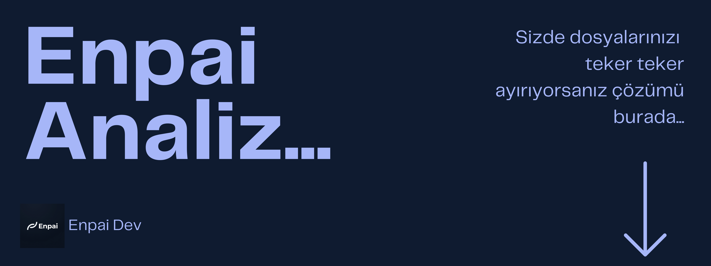

# Açık Kaynak Analiz Uygulaması

<p align="center">
  
</p>

**Enpai-Dev Analiz**, bilgisayardaki dağınık dosyaları (indirilenler, masaüstü vb.) tek tıkla toparlayan bir dosya düzenleyici. Kendi işimi kolaylaştırmak için yaptım, arayüzü sade ve kullanımı oldukça basit.

## ✨ Ne İşe Yarıyor?

- 🌌 **Sade Tasarım:** Koyu renkli, göz yormayan basit bir arayüzü var. Arka planda da ufak bir kar efekti ekledim.
- 📂 **Hızlı Düzenleme:** İstediğin klasörü seçiyorsun, içindeki dosyaları (oyun, kod, medya vb. diye) otomatik ayırıyor.
- 🚀 **Taşıma ve Kopyalama:** Dosyaları ister tamamen başka bir yere taşıyabiliyor, istersen de sadece kopyalarını alabiliyorsun.
- ⚡ **Takılmadan Çalışıyor:** Electron.js kullandığım için arka planda binlerce dosya varken bile çökmüyor veya takılmıyor.

## 🚧 Nasıl Yaptım? (Geliştirme Aşamaları)

1. İlk başta dosyaları taşımak için ufak bir **Python** scripti yazarak mantığı kurdum.
2. Sadece terminalden kullanmak sıkıcı gelince bunu **Electron.js** ile masaüstü uygulamasına çevirdim.
3. Arayüzü tasarlarken koyu renkler kullanıp arka plana hoşuma giden basit animasyonlar ekledim.
4. Ön yüz ile arka planın sorunsuz haberleşmesi için IPC (Electron haberleşme kanalları) bağlantılarını kurdum.
5. Kodları biraz daha toparlayıp açık kaynak olarak buraya yükledim.

## 🛠️ Kurulum

1. Depoyu klonlayın:
   ```bash
   git clone https://github.com/Enous/Enpai-Analiz.git
   ```
2. Bağımlılıkları kurun:
   ```bash
   npm install
   ```
3. Uygulamayı başlatın:
   ```bash
   npm start
   ```

---

Developed with 💜 by [Enous](https://github.com/Enous)
