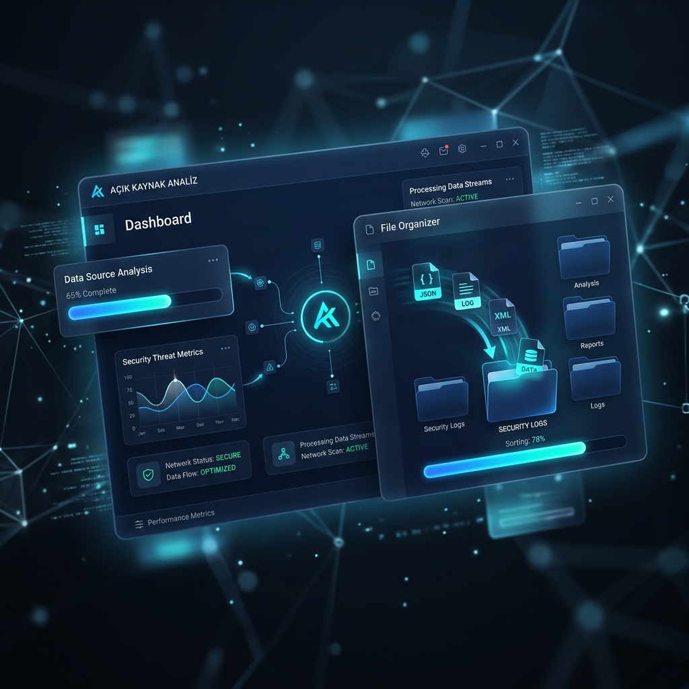

# 🍌 Açık Kaynak Analiz Uygulaması - Electron Edition

<p align="center">
  
</p>

**Açık Kaynak Analiz Uygulaması**, bilgisayarınızdaki dosya karmaşasını saniyeler içinde çözen, "Parlayan Gece Mavisi" (Night Blue) temalı akıllı dosya organizatörüdür. Electron mimarisi ile hem hızlı hem de görsel olarak premium bir deneyim sunar.

## ✨ Özellikler

- 🌌 **Gece Mavisi Tasarımı:** Glassmorphism ve modern neon efektleri.
- 🚀 **Hızlı İşlemler:** Node.js tabanlı yüksek performanslı dosya yönetimi.
- 🔍 **Akıllı Analiz:** Dosyaları uzantılarına göre otomatik kategorize etme.
- 🖱️ **Dinamik Arayüz:** Akıcı animasyonlar ve modern kullanıcı deneyimi.

## 🛠️ Kurulum

1. Depoyu klonlayın:
   ```bash
   git clone https://github.com/Enous/Enpai-Analiz.git
   ```
2. Bağımlılıkları kurun:
   ```bash
   npm install
   ```
3. Uygulamayı başlatın:
   ```bash
   npm start
   ```

---
Developed with 💜 by [Enous](https://github.com/Enous)
